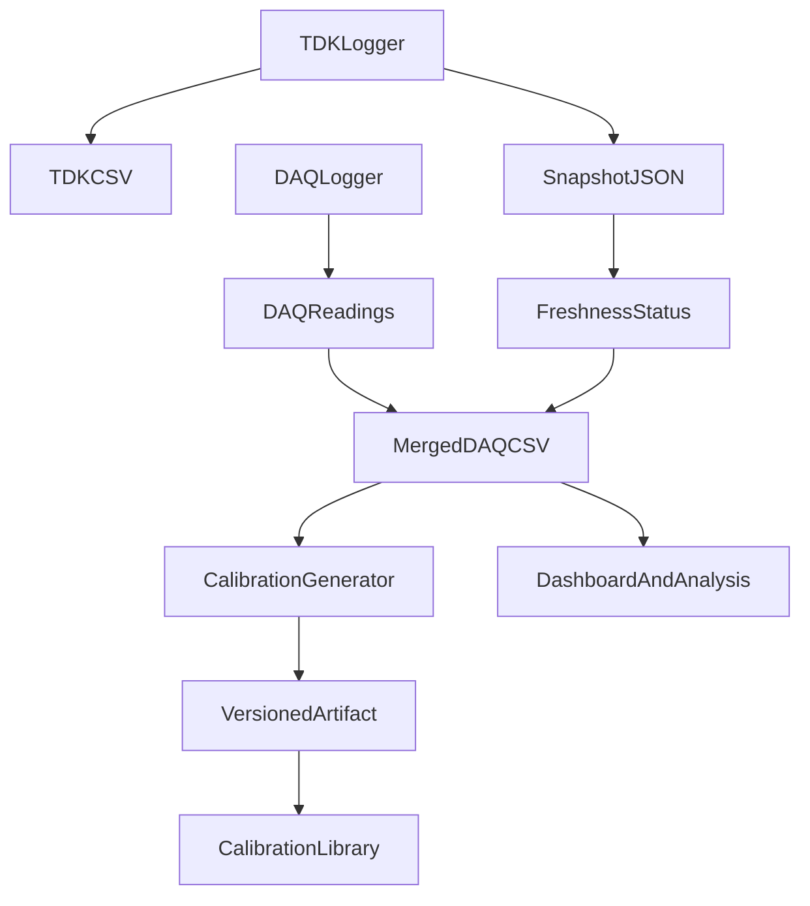

# Instrumentation Calibration Workbench

This public repository is a portfolio-focused research-engineering project. It demonstrates how Python can coordinate laboratory instrumentation, merge telemetry from independent devices, and preserve calibration lineage through reproducible artifacts.

The core idea is simple: a DAQ logger records measurement channels, a power-supply logger publishes the latest telemetry snapshot, and the DAQ row records whether that telemetry was fresh, stale, or missing. A calibration package then turns raw DAQ current readings into reference-scale values using a versioned JSON artifact.

Beyond the DAQ/TDK pair, the repo now also shows the LunarRego plasma-diagnostics operator GUI (LP / EP / RPA) and a public I–V review path that estimates plasma-related voltages from `dI/dV` on approved example CSVs only.

## Documentation (start here)

Everything you need is in the repo as normal Markdown — click the links below (they work on GitHub and locally).

| Topic | Link |
| --- | --- |
| Documentation index | [docs/README.md](docs/README.md) |
| Architecture and data flow | [docs/architecture/dataflow.md](docs/architecture/dataflow.md) |
| Calibration methodology | [docs/calibration/methodology.md](docs/calibration/methodology.md) |
| Plasma diagnostics (LP / EP / RPA) | [docs/plasma_diagnostics/methodology.md](docs/plasma_diagnostics/methodology.md) |
| Runbooks (commands) | [docs/workflows/runbooks.md](docs/workflows/runbooks.md) |
| Reproducibility and public boundary | [docs/reproducibility.md](docs/reproducibility.md) |
| Synthetic / approved examples | [examples/](examples/) |

**GitHub Wiki (optional companion):** [Project Wiki](https://github.com/harshddes/instrumentation-calibration-workbench/wiki) — a shorter, reader-friendly companion to the canonical [docs/](docs/) pages.

Wiki source files (browse in the repo): [wiki/Home.md](wiki/Home.md) · [Architecture](wiki/Architecture.md) · [Calibration](wiki/Calibration.md) · [Screenshots](wiki/Screenshots.md) · [Reproducibility](wiki/Reproducibility.md)

## What This Shows

- Multi-instrument logging architecture with a JSON snapshot bridge.
- Keithley DAQ scan logic with CSV output and TDK telemetry columns.
- TDK Lambda telemetry/control code with logging, GUI operation, and safety-oriented state handling.
- LunarRego LP / EP / RPA operator GUI with hardware-map role assignment and Keithley backends.
- Public I–V review for approved LP, EP, and RPA CSVs, including `dI/dV` plasma-potential markers.
- A calibration generator that stores source hashes, cleaning rules, model coefficients, fit quality, and review plots.
- A reusable calibration library for scripts, notebooks, and downstream analysis.
- GUI and dashboard surfaces suitable for operator workflows and data exploration.

## Screenshots

Operator GUI surfaces and plasma-diagnostics review plots. SVG mockups / regenerated plots live in [docs/assets/readme/](docs/assets/readme/).


## Repository Map

| Path | Purpose |
| --- | --- |
| [instrumentation/daq/](instrumentation/daq/) | Keithley DAQ acquisition class and Tk GUI entry point. |
| [instrumentation/tdk/](instrumentation/tdk/) | TDK Lambda telemetry/control logic and Tk GUI entry point. |
| [instrumentation/lunar_rego/](instrumentation/lunar_rego/) | LunarRego LP / EP / RPA GUI, Keithley backends, and I–V / dI/dV review. |
| [instrumentation/snapshot.py](instrumentation/snapshot.py) | Shared snapshot contract used to bridge TDK telemetry into DAQ rows. |
| [tdk_snapshot.py](tdk_snapshot.py) | Compatibility copy of the snapshot helper for older examples and traces. |
| [calibration_process/](calibration_process/) | Versioned calibration generator, runtime library, synthetic sources, and demo artifacts. |
| [examples/](examples/) | Synthetic DAQ/TDK examples plus approved LP / EP / RPA CSVs only. |
| [test_logging/](test_logging/) | Retained test logs approved for this public showcase. |
| [tdklambda/data/](tdklambda/data/) | Retained TDK data/examples approved for this public showcase. |
| [code_xray/](code_xray/) | Static/dynamic code-tracing experiment for understanding DAQ variable flow. |
| [SCD_3D_AI_Lab/](SCD_3D_AI_Lab/) | Streamlit CSV exploration dashboard retained as a supporting analysis tool. |
| [docs/](docs/) | Architecture, calibration, workflow, and reproducibility documentation. |
| [wiki/](wiki/) | Markdown source for GitHub Wiki pages (see Documentation section above). |

## Data Flow



## Quick Start

Create an environment and install the common dependencies:

```powershell
python -m venv .venv
.\.venv\Scripts\Activate.ps1
python -m pip install -r requirements.txt
```

Regenerate the synthetic calibration artifact:

```powershell
python -m calibration_process.generate_keeper_current_calibration
```

Use the calibration library:

```python
from calibration_process import apply_keeper_current_calibration

reference_current = apply_keeper_current_calibration(1.25)
```

Run the DAQ GUI:

```powershell
python -m instrumentation.daq.GUI_DAQ2700
```

Run the TDK GUI:

```powershell
python -m instrumentation.tdk.GUI_TDK
```

Run the LunarRego LP / EP / RPA GUI:

```powershell
python -m instrumentation.lunar_rego.GUI_LunarRego
```

Regenerate plasma-diagnostics review plots from the approved public CSVs:

```powershell
python -m instrumentation.lunar_rego.analyze_iv_curves
```

Run the CSV dashboard:

```powershell
cd SCD_3D_AI_Lab
streamlit run app.py
```

Command details: [docs/workflows/runbooks.md](docs/workflows/runbooks.md)

## Calibration Demo

The default public artifact is generated from synthetic data:

[calibration_process/artifacts/demo_keeper_current_linear.json](calibration_process/artifacts/demo_keeper_current_linear.json)

The model is:

```text
ps_1_current = 0.4 * DAQ_KEEPER_I + 0.01
```

The synthetic artifact is deliberately small so reviewers can inspect the full lineage: source CSV, raw snapshot copy, cleaned CSV, rejected-row CSV, JSON metadata, and SVG plot. See [docs/calibration/methodology.md](docs/calibration/methodology.md).

## Snapshot Contract

The project keeps the real-time bridge explicit. A snapshot payload contains:

```json
{
  "id": 1.0,
  "timestamp": 1778278309.8,
  "sequence": 11,
  "published_at": 1778278310.0,
  "fields": {
    "ps_1_voltage": "320.0",
    "ps_1_current": "1.210",
    "ps_1_output_state": "ON",
    "ps_2_voltage": "0.0",
    "ps_2_current": "0.000",
    "ps_2_output_state": "OFF"
  }
}
```

[tdk_snapshot.json](tdk_snapshot.json) is retained as an approved runtime-state sample. It is not a complete experiment record. For a portable example, use [examples/tdk_snapshot.example.json](examples/tdk_snapshot.example.json).

## Vendor References

The [tdklambda/](tdklambda/) folder includes approved vendor/reference PDFs for VISA and TDK Lambda operation. They are included for context and remain third-party reference documents, not original project source code.

## Plasma Diagnostics Demo

Approved public CSVs only:

- [examples/plasma_diagnostics/LP_07302026_140808.csv](examples/plasma_diagnostics/LP_07302026_140808.csv)
- [examples/plasma_diagnostics/RPA_combined_07302026_172017.csv](examples/plasma_diagnostics/RPA_combined_07302026_172017.csv)
- [examples/plasma_diagnostics/EP_PlasmaDiagnostics_exp.csv](examples/plasma_diagnostics/EP_PlasmaDiagnostics_exp.csv)

Regenerated markers (see [docs/plasma_diagnostics/methodology.md](docs/plasma_diagnostics/methodology.md)):

| Diagnostic | Public estimate |
| --- | --- |
| LP | `V* ≈ 23.6 V` from dI/dV peak; `V_f ≈ 11.5 V` at I≈0 |
| RPA | `V* ≈ 16.6 V` on smoothed collector dI/dV (noisy trace) |
| EP | `Vp ≈ 21.3 V` from high-emission floating-potential asymptote |

## Public-Release Boundary

This repository is curated from a larger working lab repository. Large experiment trees, scratch folders, private editor metadata, and device-specific code outside this showcase scope are intentionally excluded. For LunarRego, only the three approved LP / EP / RPA CSVs above are public; other experiment logs stay private. Details: [docs/reproducibility.md](docs/reproducibility.md)
