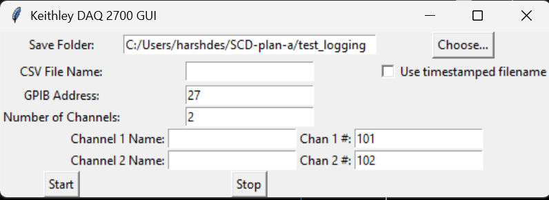
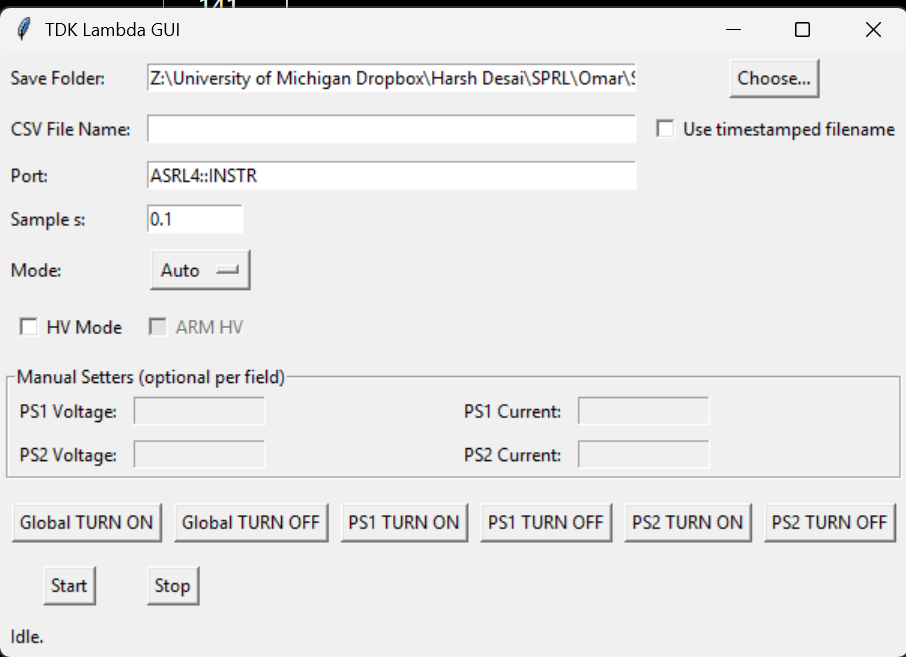
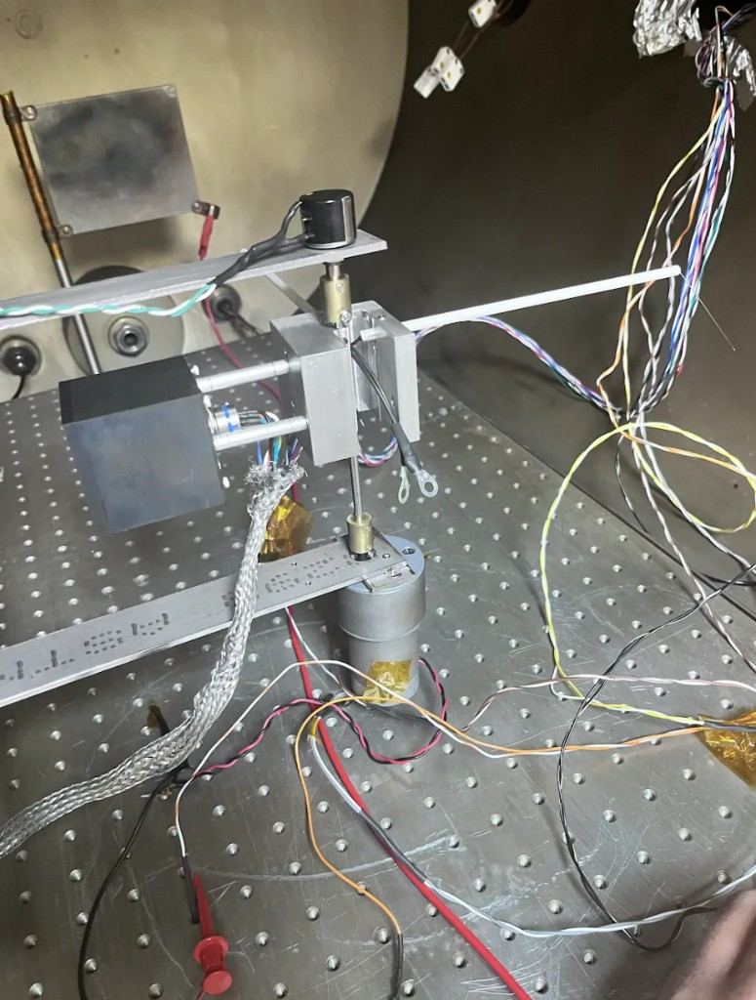
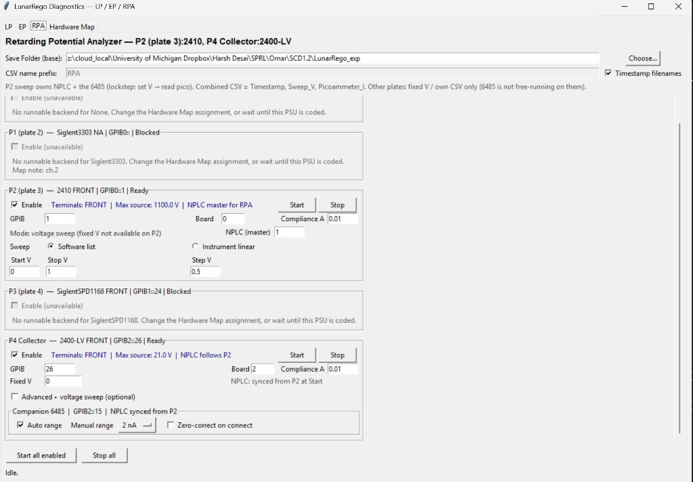
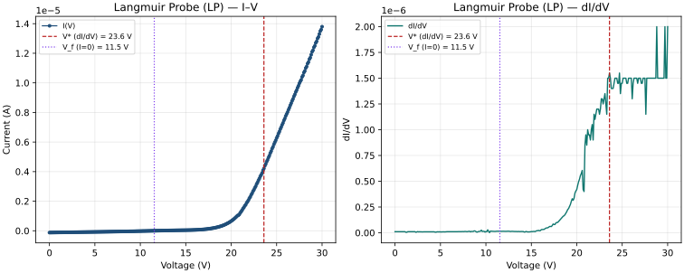
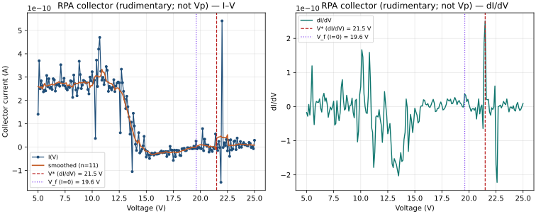
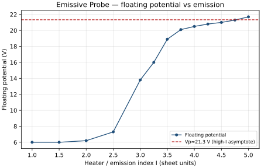
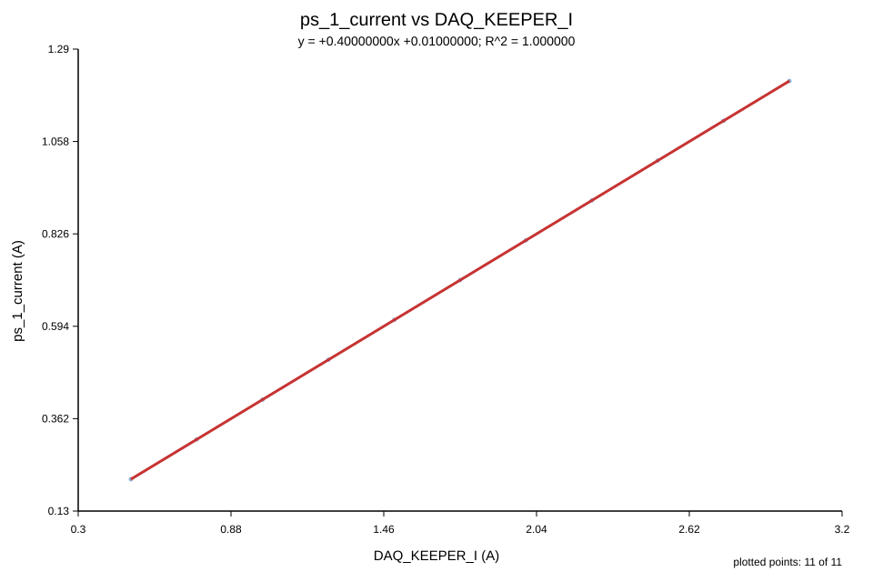
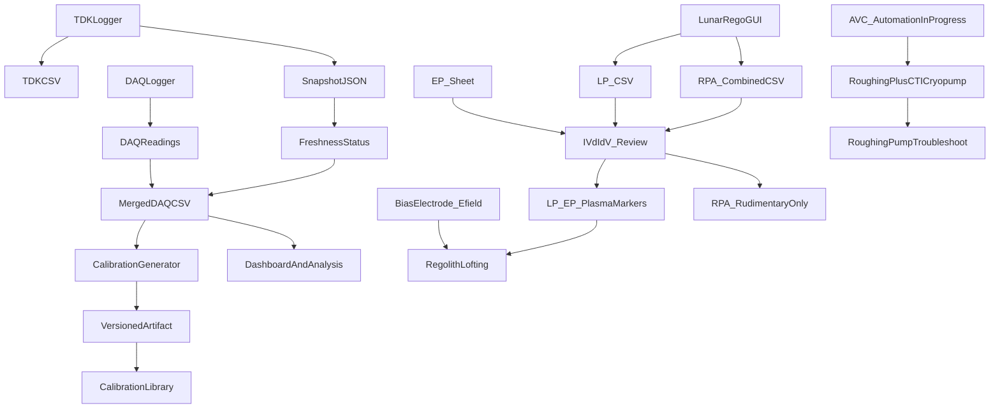

# Instrumentation Calibration Workbench

This public repository is a portfolio-focused research-engineering project. It demonstrates how Python can coordinate laboratory instrumentation, merge telemetry from independent devices, and preserve calibration lineage through reproducible artifacts.

The core idea is simple: a DAQ logger records measurement channels, a power-supply logger publishes the latest telemetry snapshot, and the DAQ row records whether that telemetry was fresh, stale, or missing. A calibration package then turns raw DAQ current readings into reference-scale values using a versioned JSON artifact.

Beyond the DAQ/TDK pair, the repo also shows the **LunarRego plasma-diagnostics** operator path: Langmuir Probe (LP), Emissive Probe (EP), and Retarding Potential Analyzer (RPA), plus a public I–V / `dI/dV` review on approved example CSVs only.

## Portfolio PDF

A clickable multi-page showcase PDF (overview, architecture, GUIs, chamber electrode, LP/EP/RPA results, calibration, and repository links):

[docs/Instrumentation_Calibration_Workbench_Showcase.pdf](docs/Instrumentation_Calibration_Workbench_Showcase.pdf)

Regenerate after content updates:

```powershell
python docs/generate_showcase_pdf.py
```

## Documentation (start here)

Everything you need is in the repo as normal Markdown — click the links below (they work on GitHub and locally).

| Topic | Link |
| --- | --- |
| Documentation index | [docs/README.md](docs/README.md) |
| Architecture and data flow | [docs/architecture/dataflow.md](docs/architecture/dataflow.md) |
| Calibration methodology | [docs/calibration/methodology.md](docs/calibration/methodology.md) |
| Plasma diagnostics (LP / EP / RPA) | [docs/plasma_diagnostics/methodology.md](docs/plasma_diagnostics/methodology.md) |
| Runbooks (commands) | [docs/workflows/runbooks.md](docs/workflows/runbooks.md) |
| Reproducibility and public boundary | [docs/reproducibility.md](docs/reproducibility.md) |
| Synthetic / approved examples | [examples/](examples/) |

**GitHub Wiki (optional companion):** [Project Wiki](https://github.com/harshddes/instrumentation-calibration-workbench/wiki) — a shorter, reader-friendly companion to the canonical [docs/](docs/) pages.

Wiki source files (browse in the repo): [wiki/Home.md](wiki/Home.md) · [Architecture](wiki/Architecture.md) · [Calibration](wiki/Calibration.md) · [Plasma Diagnostics](wiki/PlasmaDiagnostics.md) · [Screenshots](wiki/Screenshots.md) · [Reproducibility](wiki/Reproducibility.md)

## What This Shows

- Multi-instrument logging architecture with a JSON snapshot bridge.
- Keithley DAQ scan logic with CSV output and TDK telemetry columns.
- TDK Lambda telemetry/control code with logging, GUI operation, and safety-oriented state handling.
- LunarRego LP / EP / RPA operator GUI with hardware-map role assignment and Keithley backends.
- Vacuum-chamber plasma diagnostics tied to a bias electrode used for lunar-regolith-simulant lofting studies.
- Public I–V review for approved LP / EP / RPA CSVs (LP/EP plasma-potential markers; RPA shown as rudimentary collector dI/dV only).
- A calibration generator that stores source hashes, cleaning rules, model coefficients, fit quality, and review plots.
- A reusable calibration library for scripts, notebooks, and downstream analysis.
- GUI and dashboard surfaces suitable for operator workflows and data exploration.

## Screenshots

### DAQ and TDK operator GUIs





### LunarRego chamber and diagnostics GUI

Vacuum-chamber probe assembly used for LunarRego plasma diagnostics. The square metallic plate on the left is the **bias electrode**: it is driven to a chosen **positive or negative** potential to generate the desired electric field while lunar-regolith simulant lofting / charging is observed. The horizontal probe and central stack carry the plasma diagnostics (LP / EP / RPA path) into the measurement volume.



Operator GUI for LP / EP / RPA acquisition. The RPA tab maps each plate to an instrument role: **P2** (Keithley 2410) owns the retarding-voltage sweep and NPLC master timing; **P4 collector** (Keithley 2400-LV) holds collector bias while a Keithley **6485** picoammeter records collector current in lockstep (`set V → read pico`). Combined CSV columns are `Timestamp, Sweep_V, Picoammeter_I`.



### Plasma-diagnostics review plots









## LunarRego Plasma Diagnostics (technical)

LunarRego couples three classical plasma probes to a dust / regolith electric-field experiment:

| Probe | What it measures | Public analysis marker |
| --- | --- | --- |
| **Langmuir Probe (LP)** | Collected current vs probe bias | `V*` = electron-transition peak of `dI/dV`; `V_f` = I≈0 crossing |
| **Emissive Probe (EP)** | Floating potential vs thermionic emission | `Vp` ≈ high-emission floating-potential asymptote |
| **RPA** | Collector current vs retarding voltage on P2 | Rudimentary `dI/dV` feature only — **not** reported as plasma potential |

### Why the bias electrode matters

The chamber electrode is not a diagnostic — it is the **field actuator**. Applying +V or −V sets the electric field that drives charged lunar-regolith simulant. LP / EP (and, with fuller campaigns, RPA) quantify the plasma environment so lofting observations can be compared against measured plasma references rather than assumed ones.

### Vacuum system status (current)

The chamber vacuum train is a **roughing pump + CTI cryopump** combination. Right now there is a problem with the **roughing pump**, so the team is **troubleshooting the vacuum system** while preparing for additional diagnostic runs. In parallel, work is underway to **automate the automatic valve controller (AVC)** that sequences the roughing / cryopump path.

Until vacuum is stable again, the public RPA traces should be read as **rudimentary early results** from the acquisition / analysis pipeline — not as finalized plasma-potential values. More RPA (and related) results are planned once the vacuum system is healthy and AVC automation is in place.

### RPA acquisition contract

```text
Hardware Map roles  →  P2 sweep (2410) + P4 collector (2400-LV) + 6485 picoammeter
Lockstep            →  for each Sweep_V: set P2 → read 6485
Combined CSV        →  Timestamp, Sweep_V, Picoammeter_I
Other plates        →  fixed bias / own CSV only (6485 is not free-running on them)
```

Full plate map, GUI behavior, and interpretation notes: [docs/plasma_diagnostics/methodology.md](docs/plasma_diagnostics/methodology.md).

## Repository Map

| Path | Purpose |
| --- | --- |
| [instrumentation/daq/](instrumentation/daq/) | Keithley DAQ acquisition class and Tk GUI entry point. |
| [instrumentation/tdk/](instrumentation/tdk/) | TDK Lambda telemetry/control logic and Tk GUI entry point. |
| [instrumentation/lunar_rego/](instrumentation/lunar_rego/) | LunarRego LP / EP / RPA GUI, Keithley backends, and I–V / dI/dV review. |
| [instrumentation/snapshot.py](instrumentation/snapshot.py) | Shared snapshot contract used to bridge TDK telemetry into DAQ rows. |
| [tdk_snapshot.py](tdk_snapshot.py) | Compatibility copy of the snapshot helper for older examples and traces. |
| [calibration_process/](calibration_process/) | Versioned calibration generator, runtime library, synthetic sources, and demo artifacts. |
| [examples/](examples/) | Synthetic DAQ/TDK examples plus approved LP / EP / RPA CSVs only. |
| [test_logging/](test_logging/) | Retained test logs approved for this public showcase. |
| [tdklambda/data/](tdklambda/data/) | Retained TDK data/examples approved for this public showcase. |
| [code_xray/](code_xray/) | Static/dynamic code-tracing experiment for understanding DAQ variable flow. |
| [SCD_3D_AI_Lab/](SCD_3D_AI_Lab/) | Streamlit CSV exploration dashboard retained as a supporting analysis tool. |
| [docs/](docs/) | Architecture, calibration, workflow, and reproducibility documentation. |
| [wiki/](wiki/) | Markdown source for GitHub Wiki pages (see Documentation section above). |

## Data Flow



## Quick Start

Create an environment and install the common dependencies:

```powershell
python -m venv .venv
.\.venv\Scripts\Activate.ps1
python -m pip install -r requirements.txt
```

Regenerate the synthetic calibration artifact:

```powershell
python -m calibration_process.generate_keeper_current_calibration
```

Use the calibration library:

```python
from calibration_process import apply_keeper_current_calibration

reference_current = apply_keeper_current_calibration(1.25)
```

Run the DAQ GUI:

```powershell
python -m instrumentation.daq.GUI_DAQ2700
```

Run the TDK GUI:

```powershell
python -m instrumentation.tdk.GUI_TDK
```

Run the LunarRego LP / EP / RPA GUI:

```powershell
python -m instrumentation.lunar_rego.GUI_LunarRego
```

Regenerate plasma-diagnostics review plots from the approved public CSVs:

```powershell
python -m instrumentation.lunar_rego.analyze_iv_curves
```

Run the CSV dashboard:

```powershell
cd SCD_3D_AI_Lab
streamlit run app.py
```

Command details: [docs/workflows/runbooks.md](docs/workflows/runbooks.md)

## Calibration Demo

The default public artifact is generated from synthetic data:

[calibration_process/artifacts/demo_keeper_current_linear.json](calibration_process/artifacts/demo_keeper_current_linear.json)

The model is:

```text
ps_1_current = 0.4 * DAQ_KEEPER_I + 0.01
```

The synthetic artifact is deliberately small so reviewers can inspect the full lineage: source CSV, raw snapshot copy, cleaned CSV, rejected-row CSV, JSON metadata, and SVG plot. See [docs/calibration/methodology.md](docs/calibration/methodology.md).

## Snapshot Contract

The project keeps the real-time bridge explicit. A snapshot payload contains:

```json
{
  "id": 1.0,
  "timestamp": 1778278309.8,
  "sequence": 11,
  "published_at": 1778278310.0,
  "fields": {
    "ps_1_voltage": "320.0",
    "ps_1_current": "1.210",
    "ps_1_output_state": "ON",
    "ps_2_voltage": "0.0",
    "ps_2_current": "0.000",
    "ps_2_output_state": "OFF"
  }
}
```

[tdk_snapshot.json](tdk_snapshot.json) is retained as an approved runtime-state sample. It is not a complete experiment record. For a portable example, use [examples/tdk_snapshot.example.json](examples/tdk_snapshot.example.json).

## Vendor References

The [tdklambda/](tdklambda/) folder includes approved vendor/reference PDFs for VISA and TDK Lambda operation. They are included for context and remain third-party reference documents, not original project source code.

## Plasma Diagnostics Demo

Approved public CSVs only:

- [examples/plasma_diagnostics/LP_07302026_140808.csv](examples/plasma_diagnostics/LP_07302026_140808.csv)
- [examples/plasma_diagnostics/RPA_combined_07302026_170652.csv](examples/plasma_diagnostics/RPA_combined_07302026_170652.csv)
- [examples/plasma_diagnostics/EP_PlasmaDiagnostics_exp.csv](examples/plasma_diagnostics/EP_PlasmaDiagnostics_exp.csv)

Regenerated markers (see [docs/plasma_diagnostics/methodology.md](docs/plasma_diagnostics/methodology.md)):

| Diagnostic | Public estimate / note |
| --- | --- |
| LP | `V* ≈ 23.6 V` from dI/dV peak; `V_f ≈ 11.5 V` at I≈0 |
| EP | `Vp ≈ 21.3 V` from high-emission floating-potential asymptote |
| RPA | Rudimentary collector `dI/dV` feature ≈ 21.5 V on `…170652.csv` — **not** claimed as plasma potential; more runs planned after vacuum troubleshooting |

**Status:** vacuum system (roughing pump + CTI cryopump) is under troubleshooting due to a roughing-pump issue; AVC automation is in progress for future automated pump-down sequences.

## Public-Release Boundary

This repository is curated from a larger working lab repository. Large experiment trees, scratch folders, private editor metadata, and device-specific code outside this showcase scope are intentionally excluded. For LunarRego, only the three approved LP / EP / RPA CSVs above are public; other experiment logs stay private. Details: [docs/reproducibility.md](docs/reproducibility.md)
