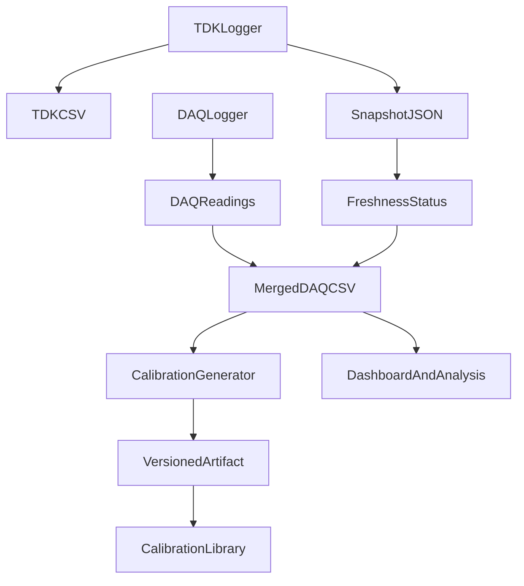

# Instrumentation Calibration Workbench

This public repository is a portfolio-focused research-engineering project. It demonstrates how Python can coordinate laboratory instrumentation, merge telemetry from independent devices, and preserve calibration lineage through reproducible artifacts.

The core idea is simple: a DAQ logger records measurement channels, a power-supply logger publishes the latest telemetry snapshot, and the DAQ row records whether that telemetry was fresh, stale, or missing. A calibration package then turns raw DAQ current readings into reference-scale values using a versioned JSON artifact.

## What This Shows

- Multi-instrument logging architecture with a JSON snapshot bridge.
- Keithley DAQ scan logic with CSV output and TDK telemetry columns.
- TDK Lambda telemetry/control code with logging, GUI operation, and safety-oriented state handling.
- A calibration generator that stores source hashes, cleaning rules, model coefficients, fit quality, and review plots.
- A reusable calibration library for scripts, notebooks, and downstream analysis.
- GUI and dashboard surfaces suitable for operator workflows and data exploration.

## Screenshots

These images show the actual operator GUI surfaces used by the DAQ and TDK logging tools. The earlier SVG mockups are still kept in `docs/assets/readme/` as design/reference assets.


## Repository Map

| Path | Purpose |
| --- | --- |
| `instrumentation/daq/` | Keithley DAQ acquisition class and Tk GUI entry point. |
| `instrumentation/tdk/` | TDK Lambda telemetry/control logic and Tk GUI entry point. |
| `instrumentation/snapshot.py` | Shared snapshot contract used to bridge TDK telemetry into DAQ rows. |
| `tdk_snapshot.py` | Compatibility copy of the snapshot helper for older examples and traces. |
| `calibration_process/` | Versioned calibration generator, runtime library, synthetic sources, and demo artifacts. |
| `examples/` | Synthetic merged-session CSV, synthetic calibration CSV, and example snapshot JSON. |
| `test_logging/` | Retained test logs approved for this public showcase. |
| `tdklambda/data/` | Retained TDK data/examples approved for this public showcase. |
| `code_xray/` | Static/dynamic code-tracing experiment for understanding DAQ variable flow. |
| `SCD_3D_AI_Lab/` | Streamlit CSV exploration dashboard retained as a supporting analysis tool. |
| `docs/` | Architecture, calibration, workflow, and reproducibility documentation. |
| `wiki/` | Markdown source for the GitHub Wiki pages. |

## Data Flow



## Quick Start

Create an environment and install the common dependencies:

```powershell
python -m venv .venv
.\.venv\Scripts\Activate.ps1
python -m pip install -r requirements.txt
```

Regenerate the synthetic calibration artifact:

```powershell
python -m calibration_process.generate_keeper_current_calibration
```

Use the calibration library:

```python
from calibration_process import apply_keeper_current_calibration

reference_current = apply_keeper_current_calibration(1.25)
```

Run the DAQ GUI:

```powershell
python -m instrumentation.daq.GUI_DAQ2700
```

Run the TDK GUI:

```powershell
python -m instrumentation.tdk.GUI_TDK
```

Run the CSV dashboard:

```powershell
cd SCD_3D_AI_Lab
streamlit run app.py
```

## Calibration Demo

The default public artifact is generated from synthetic data:

```text
calibration_process/artifacts/demo_keeper_current_linear.json
```

The model is:

```text
ps_1_current = 0.4 * DAQ_KEEPER_I + 0.01
```

The synthetic artifact is deliberately small so reviewers can inspect the full lineage: source CSV, raw snapshot copy, cleaned CSV, rejected-row CSV, JSON metadata, and SVG plot.

## Snapshot Contract

The project keeps the real-time bridge explicit. A snapshot payload contains:

```json
{
  "id": 1.0,
  "timestamp": 1778278309.8,
  "sequence": 11,
  "published_at": 1778278310.0,
  "fields": {
    "ps_1_voltage": "320.0",
    "ps_1_current": "1.210",
    "ps_1_output_state": "ON",
    "ps_2_voltage": "0.0",
    "ps_2_current": "0.000",
    "ps_2_output_state": "OFF"
  }
}
```

`tdk_snapshot.json` is retained as an approved runtime-state sample. It is not a complete experiment record. For a portable example, use `examples/tdk_snapshot.example.json`.

## Vendor References

The `tdklambda/` folder includes approved vendor/reference PDFs for VISA and TDK Lambda operation. They are included for context and remain third-party reference documents, not original project source code.

## Public-Release Boundary

This repository is curated from a larger working lab repository. Large experiment trees, scratch folders, private editor metadata, and device-specific code outside this showcase scope are intentionally excluded. Retained support folders were kept because they help demonstrate the engineering workflow.

## Documentation

Start here:

- `docs/README.md`
- `docs/architecture/dataflow.md`
- `docs/calibration/methodology.md`
- `docs/workflows/runbooks.md`
- `docs/reproducibility.md`

GitHub Wiki source pages live in `wiki/`.
