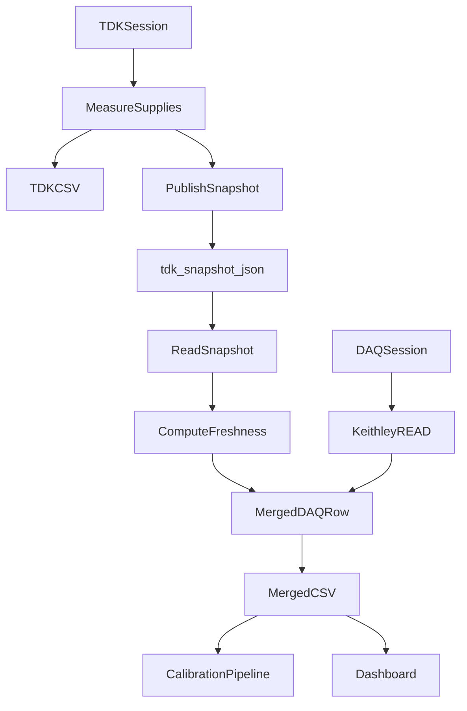
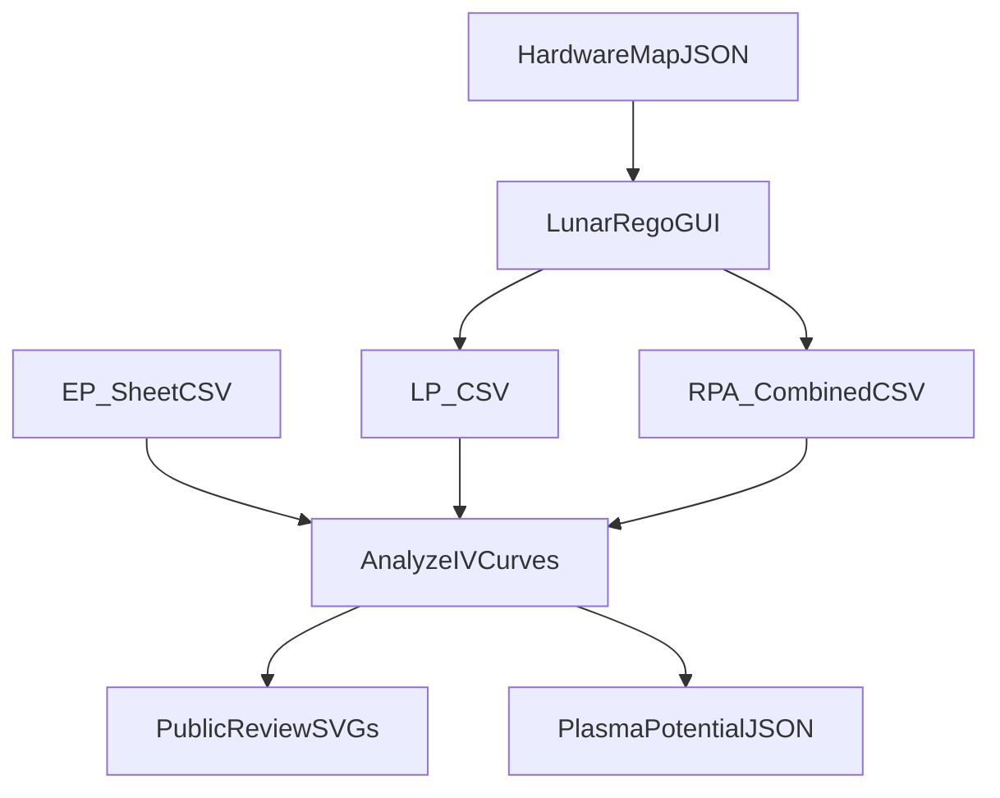

# Architecture And Data Flow

[Back to documentation index](../README.md)

## Objective

The workbench demonstrates a common lab-software problem: two instruments produce related data, but not from one shared process or clock. The implemented solution uses a small JSON snapshot as a bridge between TDK telemetry and DAQ rows.

## Flow



## LunarRego Diagnostics Path



Only the approved LP / EP / RPA example CSVs are retained publicly. See [plasma diagnostics methodology](../plasma_diagnostics/methodology.md).

## Snapshot Contract

[instrumentation/snapshot.py](../../instrumentation/snapshot.py) defines:

- `TDK_FIELDS`: supply voltage/current/output-state fields.
- `TDK_METADATA_FIELDS`: timestamp, age, status, and voltage sum fields.
- `MERGED_FIELDS`: the exact TDK columns appended to DAQ CSV rows.
- `publish_snapshot()`: atomic JSON writer.
- `read_snapshot()`: defensive JSON reader.
- `compute_freshness()`: converts timing into `fresh`, `stale`, `missing`, or `invalid`.
- `extract_tdk_columns()`: converts snapshot state into CSV-safe cells.

The DAQ header is:

```text
Timestamp + selected DAQ channels + MERGED_FIELDS
```

## Freshness Meaning

`fresh` means the TDK row is recent enough relative to the DAQ timestamp. `stale` means the value is old but still useful context. `missing` means no trustworthy snapshot exists. `invalid` means the payload does not match the expected snapshot contract.

The key engineering idea is not pretending the instruments are perfectly synchronized. The system records the timing quality explicitly so downstream analysis can decide whether a row is usable.

## Public Files

- [instrumentation/daq/DAQ2700.py](../../instrumentation/daq/DAQ2700.py)
- [instrumentation/tdk/TDKLogic.py](../../instrumentation/tdk/TDKLogic.py)
- [instrumentation/snapshot.py](../../instrumentation/snapshot.py)
- [tdk_snapshot.json](../../tdk_snapshot.json)
- [examples/tdk_snapshot.example.json](../../examples/tdk_snapshot.example.json)
